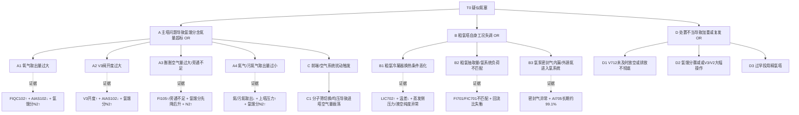
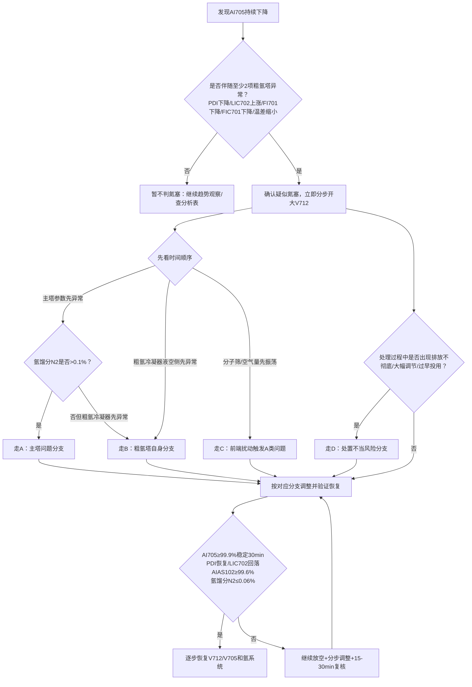

# 氮塞故障树 v1.0（严格按氮塞问题集整理）

## 1. 制作边界

本故障树以“疑似氮塞”为顶事件，严格采用 2—3 层结构：  
- 顶事件：疑似氮塞；  
- 一级分支：主塔问题、粗氩塔自身问题、前端/空气系统扰动、处置不当导致加重或复发；  
- 叶子节点：落到具体测点、趋势、阈值、操作记录或人工确认项。  

设计原则：  
1. 顶事件确认采用 `AND + K_OF_N`。  
2. 一级原因采用 `OR`，因为多原因可并存。  
3. 具体原因采用 `AND` 或 `K_OF_N`。  
4. 树结构无环；同一测点可作为多个节点的证据，但节点之间不互相回指。  
5. 操作处理不作为初始根因，但作为“加重/复发风险分支”进入路由。

---

## 2. 顶事件确认规则

```json
{
  "logic": "AND",
  "conditions": [
    {
      "rule_id": "T0-R1",
      "tag": "AI705",
      "name": "粗氩纯度",
      "operator": "trend_down",
      "window": "15-30min",
      "threshold_reference": "正常≥99.9%，严重可降至80%以下；预警阶段99.5%-99.7%",
      "description": "AI705持续下降是最核心的氮塞确认信号"
    },
    {
      "logic": "K_OF_N",
      "k": 2,
      "conditions": [
        {
          "rule_id": "T0-R2",
          "tag": "PDI701/粗氩塔Ⅱ阻力",
          "operator": "trend_down",
          "threshold_reference": "设计值附近；预警阶段下降1%-3%",
          "description": "粗氩塔阻力下降或波动"
        },
        {
          "rule_id": "T0-R3",
          "tag": "LIC702",
          "operator": "trend_up",
          "threshold_reference": "设定值附近",
          "description": "粗氩冷凝器液空液位上涨"
        },
        {
          "rule_id": "T0-R4",
          "tag": "FI701",
          "operator": "trend_down",
          "threshold_reference": "正常工况流量",
          "description": "氩馏分流量减少"
        },
        {
          "rule_id": "T0-R5",
          "tag": "FIC701",
          "operator": "trend_down",
          "threshold_reference": "正常工况流量",
          "description": "粗氩流量减少"
        },
        {
          "rule_id": "T0-R6",
          "tag": "CONDENSER_DELTA_T",
          "operator": "trend_down",
          "threshold_reference": "设计温差值",
          "description": "粗氩冷凝器换热温差缩小"
        },
        {
          "rule_id": "T0-R7",
          "tag": "AR_FRACTION_N2",
          "operator": ">=",
          "value": 0.1,
          "unit": "%",
          "threshold_reference": "正常0%-0.06%，≥0.1%为氮塞发生",
          "description": "氩馏分含氮量达到氮塞临界值"
        }
      ]
    }
  ]
}
```

---

## 3. 故障树总图





---

## 4. 诊断路由图





---

## 5. 节点总表

| 节点编号 | 父节点 | 节点名称 | 节点类型 | 逻辑门 | 证据/判据 | 建议动作 | 恢复验证 | 来源问题 |
|---|---|---|---|---|---|---|---|---|
| A | T0 | 主塔问题导致氩馏分含氮量超标 | cause_group | OR |  |  |  |  |
| A1 | A | 氧气取出量过大 | basic_cause | AND | FIQC102/氧气取出量：超过设计值、超过额定值105%，或较历史稳定值持续增大；AIAS102/产品氧纯度：持续下降；<99.6%需关注；99.4%-99.6%预警；严重可至93%以下；AR_FRACTION_N2：>0.06%预警，≥0.1%判为氮塞风险/发生；AI701/氩馏分含氩量：正常9%-10%，>12%需警惕；多数主塔原因下上升；AR_FRACTION_O2：正常90%-91%，<90.5%轻微氮塞预警，<90%严重预警 | 适当减少氧气取出量，少则100-200 m³/h，多则约氧产量5%，分2-3次执行；同步检查氩馏分含氮量、氧纯度、AI705和PDI701；禁止一次性大幅减少氧气取出量 | AIAS102≥99.6%并稳定30min；AR_FRACTION_N2≤0.06%；AI705≥99.9%；PDI701回升并稳定 | Q4、Q5、Q6、Q7、Q8、Q30、Q31 |
| A2 | A | 液氮至上塔调节阀V3开度过大 | basic_cause | AND | V3阀开度：较正常开度增幅>2%-3%需关注；案例57%→62%约30min引发严重氮塞；AIAS102/产品氧纯度：持续下降；≥99.6%为长周期运行要求；AR_FRACTION_N2：0%-0.06%正常，≥0.1%为临界/发生；AI701/氩馏分含氩量：正常9%-10%，初期上升；AR_FRACTION_O2：正常90%-91%，下降；LIC702/PDI701/AI705：随后表现为LIC702上涨、PDI下降、AI705下降 | 关小V3阀，通常以1%-2%开度或1-2度为宜，分步执行，每步稳定15-30min；根据下塔液空纯度和主冷液位控制上、下塔回流比；与V712放空、减少氧取出量、增加污氮取出量联动 | V3回到合理开度；AIAS102回升至≥99.6%；AR_FRACTION_N2≤0.06%；AI705≥99.9%且稳定 | Q9、Q10、Q11、Q12、Q13、Q30、Q31 |
| A3 | A | 膨胀空气量过大/旁通不足 | basic_cause | AND | FI105/膨胀空气量：超过设计范围；一般不超过加工空气量12%-15%，超过15%风险显著；FIC1/V6/V450/膨胀空气旁通：旁通阀过小或长期关闭，导致过多膨胀空气进上塔；AR_FRACTION_N2：升高，≥0.1%为临界；AI701/氩馏分含氩量：特征性表现可为先降后升；AR_FRACTION_O2：下降；AIAS102：下降；污氮含氧量：降低，反映氧提取率提高 | 适当减少进上塔膨胀空气量，必要时开大旁通至污氮管；避免长期固定大旁通，应按工况动态调节；若需增加膨胀空气量，应同步减少氧气取出量并观察15-30min | 膨胀空气量回到设计范围；AR_FRACTION_N2下降至≤0.06%；AIAS102回升；AI705/PDI701恢复 | Q14、Q15、Q16、Q17、Q30、Q31 |
| A4 | A | 氮气/污氮气取出量过小 | basic_cause | AND | 产品氮气流量/污氮气取出量：低于设计值80%-85%开始显现积聚；低于70%风险显著；上塔顶部压力：较正常值升高2-3kPa需警惕，或持续升高；AR_FRACTION_N2：持续上升，≥0.1%为临界；AI701/氩馏分含氩量：上升；AIAS102：可能下降；污液氮阀门/污氮通道：阀门故障或通道受阻 | 适当增加氮气/污氮气取出量，分步执行，每步稳定15-30min；降低上塔压力，如污氮去水冷塔压力设定适当降低；同步V712放空、减少氧气取出量、适当关小V3 | 氮气/污氮气取出量恢复至设计值附近；上塔压力回落；AR_FRACTION_N2≤0.06%；AI705≥99.9% | Q18、Q19、Q20、Q21、Q30、Q31 |
| C | A | 前端/空气系统扰动触发主塔波动 | trigger_group | OR |  |  |  |  |
| C1 | C | 分子筛切换/均压导致进塔空气量振荡 | basic_cause | AND | 分子筛切换事件：切换、均压、放空阀动作在氮塞前发生；FIC101/总空气流量：切换期间出现明显振荡；上塔压力/下塔压力：出现波动；AIAS102/AR_FRACTION_N2/AI705：随后出现氧纯度下降、氩馏分含氮量上升、AI705下降 | 切换前预先增加空压机负荷或减少产品气取出量，减小主塔压力波动；切换后15-30min重点观察氧纯度、氩馏分组成、粗氩塔阻力；若进入氮塞流程，按通用流程执行V712放空和主塔调整 | 切换后主塔压力稳定；AIAS102≥99.6%；AR_FRACTION_N2≤0.06%；AI705不下降 | Q31、原因六 |
| B | T0 | 粗氩塔自身工况失调 | cause_group | OR |  |  |  |  |
| B1 | B | 粗氩冷凝器换热条件恶化 | basic_cause | K_OF_N | CONDENSER_DELTA_T：缩小，甚至趋近于零；LIC702：液空液位上涨或过高；蒸发侧压力：升高；液空氧含量：正常35%-38%；偏高会使换热温差缩小；PDI701/粗氩塔Ⅱ阻力：下降；FIC701/FI701：粗氩流量、氩馏分抽取量减少；AI705：下降 | 立即开大V712放空排氮；将粗氩冷凝器液空液位控制回合适范围，必要时液位阀切手动；调节液空回流/下塔液空纯度，使换热温差恢复；每步稳定15-30min，观察LIC702、PDI701、AI705、温差联动 | LIC702回落并稳定；换热温差恢复设计范围；PDI701回升；AI705≥99.9%稳定30min | Q22、Q23、Q24、Q25、Q29 |
| B2 | B | 粗氩抽取量/氩系统负荷不匹配 | basic_cause | AND | FI701/FI702/氩馏分抽取量：偏离正常工况，尤其处理时骤减；FIC701/粗氩取出量：相对氩馏分量过大；建议粗氩流量控制在氩馏分量约3%以下；粗氩I塔底部液位/回上塔液体量：波动或回流过多；AIAS102：若粗氩I塔回上塔液体过多，氧纯度可能下降 | 氩馏分抽取量调整每次不超过当前流量5%-10%，每步稳定15-30min；粗氩取出量按当前氩馏分量匹配，不宜盲目大幅缩小；控制粗氩I塔底部回上塔液体量，避免污染液氧 | 粗氩塔底部液位稳定；AIAS102不继续下降；PDI701回升；AI705回升 | Q22、Q25、Q28、案例二 |
| B3 | B | 氩泵密封气内漏/外源氮进入氩系统 | basic_cause | AND | 氩泵密封气类型/流量：投用氮气或压缩空气密封，密封气量异常或装置泄漏；氩泵出口压力：下降或无法建立；AI705：长期徘徊约99.1%，切换氩气密封后可升至99.7%以上；外部泄漏项：排查加温气、启动辅助管线等外部漏入 | 做密封气对比试验：氮气密封→氩气/自密封，观察AI705变化；粗氩合格后切换为自密封；若密封装置损坏，停泵检修或更换密封装置 | AI705由约99.1%提升至99.7%以上并继续恢复；氩泵出口压力稳定；密封气流量正常 | Q22、Q25 |
| D | T0 | 处置不当导致氮塞加重或二次氮塞 | secondary_risk_group | OR |  |  |  |  |
| D1 | D | V712未及时放空或排放不彻底 | secondary_risk | AND | V712开度/流量：未及时开大，或AI705未恢复就过早关小；AI705：仍下降或未≥99.9%稳定；二次下降：短时间恢复后再次下降 | 确认氮塞后立即分2-3次开大V712；严重时可开至100%；AI705≥99.9%并稳定后才可逐步关回 |  | Q26、Q27、Q28 |
| D2 | D | 氩馏分抽取量骤减或V3/V2大幅操作 | secondary_risk | OR | FI701/氩馏分抽取量：一次性减少超过5%-10%；V3/V2阀：氮塞期间一次性大幅操作，超过1%-2%分步原则；AIAS102：氧纯度被二次冲击而下降 | 所有关键调整分步进行，每步稳定15-30min；V3以1%-2%或1-2度分步；氩馏分抽取量每次不超过5%-10% |  | Q25、Q28 |
| D3 | D | 过早投用精氩塔 | secondary_risk | AND | V705：AI705未恢复即打开或精氩塔进料恢复过早；AI705/PDI701/LIC702/AR_FRACTION_N2：未同时满足恢复标准；精氩塔压力：异常升高 | 仅当AI705≥99.9%稳定30min、PDI恢复、LIC702回落、AIAS102≥99.6%、AR_FRACTION_N2≤0.06%后逐步开V705；精氩塔压力控制20-40kPa |  | Q28、Q29 |

---

## 6. 诊断执行顺序

### 第一步：确认是否疑似氮塞

先看 AI705 是否持续下降。若 AI705 持续下降，同时粗氩塔阻力下降、LIC702 上涨、FI701/FIC701 下降、粗氩冷凝器温差缩小、氩馏分含氮量升高等信号中至少满足 2 项，则进入“疑似氮塞”流程。

### 第二步：立即执行黄金动作

确认疑似氮塞后，立即分步开大 V712 粗氩放空阀。若 AI705 仍快速下降，关闭 V705 停止精氩塔工作，继续 V712 放空。AI705 未恢复至 ≥99.9% 且稳定前，不得提前关闭放空。

### 第三步：按时间顺序路由

1. 主塔参数先异常：优先进入 A 分支。  
2. 粗氩冷凝器液空侧参数先异常：优先进入 B 分支。  
3. 分子筛切换、均压、进塔空气量振荡先发生：进入 C 分支，并回查 A 类主塔问题。  
4. 已经处理但反复恶化：进入 D 分支，排查处置不当。

### 第四步：分支处理

- A1 氧气取出量过大：减少氧气取出量，分 2—3 次执行。  
- A2 V3 开度过大：关小 V3，按 1%—2% 或 1—2 度分步调整。  
- A3 膨胀空气量过大：减少进上塔膨胀空气量，必要时开大旁通至污氮管。  
- A4 氮气/污氮气取出量过小：适当增加氮气/污氮气取出量，降低上塔压力。  
- B1 粗氩冷凝器换热条件恶化：优先恢复 LIC702、蒸发侧压力、液空纯度和换热温差。  
- B2 粗氩抽取量/氩系统负荷不匹配：控制氩馏分抽取量和粗氩取出量，避免骤减。  
- B3 氩泵密封气内漏：做密封气切换对比试验，必要时切换自密封或检修。  

### 第五步：恢复判定

同时满足以下条件后，才可逐步恢复氩系统：  
1. AI705 ≥99.9%，稳定 30 min 以上；  
2. 粗氩塔阻力恢复至设计值附近，稳定 30 min 以上；  
3. LIC702 回落至设定值附近，液空侧温度与压力正常；  
4. 产品氧气纯度 AIAS102 ≥99.6%；  
5. 氩馏分含氮量 ≤0.06%，含氧量 90%—91%；  
6. 上下塔阻力和主冷液氧液位稳定；  
7. 精氩塔投用时压力控制在 20—40 kPa。  

---

## 7. 可直接用于 Agent 的输出格式

```json
{
  "event": "疑似氮塞",
  "confirmed": true,
  "confirmed_by": [
    "AI705持续下降",
    "PDI701下降",
    "LIC702上涨"
  ],
  "route": "A2",
  "route_name": "液氮至上塔调节阀V3开度过大",
  "evidence": [
    {
      "tag": "V3",
      "status": "较正常开度明显增大"
    },
    {
      "tag": "AIAS102",
      "status": "氧纯度下降"
    },
    {
      "tag": "AR_FRACTION_N2",
      "status": "含氮量接近或超过0.1%"
    },
    {
      "tag": "AI705",
      "status": "粗氩纯度下降"
    }
  ],
  "action": [
    "分步开大V712放空",
    "若AI705快速下降，关闭V705停精氩塔",
    "分步关小V3，每步稳定15-30分钟",
    "适当减少氧气取出量",
    "持续观察AI705、PDI701、LIC702、AIAS102、氩馏分含氮量"
  ],
  "recovery_criteria": [
    "AI705恢复至≥99.9%并稳定30min以上",
    "粗氩塔阻力恢复至设计值并稳定30min以上",
    "LIC702回落至设定值附近，液空侧温度与压力正常",
    "产品氧气纯度AIAS102恢复至≥99.6%",
    "氩馏分含氮量≤0.06%，含氧量90%-91%",
    "上下塔阻力和主冷液氧液位稳定",
    "精氩塔压力投用时控制20-40kPa"
  ]
}
```

---

## 8. 待现场校核项

| 类型 | 待校核内容 |
|---|---|
| 阈值 | 各装置 V3 正常开度、PDI701 设计值、LIC702 设定值、粗氩冷凝器温差设计值 |
| 位号 | 氩馏分含氮量、氩馏分含氧量、粗氩塔Ⅱ阻力、蒸发侧压力、液空纯度等实际位号 |
| 时间窗口 | AI705 下降判定窗口、PDI下降持续时间、分子筛切换影响窗口 |
| 操作权限 | V712、V705、V3、V2、V701、V702、V751、V706 等阀门是否可由系统建议或仅人工确认 |
| 基准值 | 设计值、历史稳态均值、班组操作规程值之间的优先级 |

---

## 9. 文件配套说明

本 Markdown 适合给老师或团队解释故障树逻辑；配套 JSON 文件适合给前端、Agent 或后端规则引擎读取。
