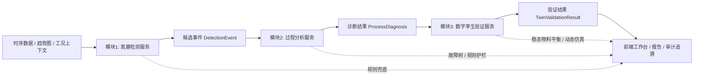

# 氮塞三模块改造方案

## 1. 改造目标

将当前“规则驱动的氮塞分析 Demo”逐步改造成“三模型闭环系统”：

1. 氮塞检测模块
基于图像识别小模型识别 `AI705` 及相关趋势图中的下凹形态，输出候选氮塞事件。

2. 过程分析模块
基于空分垂域微调模型，结合故障树、物料平衡、关键测点联动关系，对候选事件进行原因排序与证据解释。

3. 数字孪生验证模块
基于稳态/动态仿真模型，对建议动作和诊断结论进行可行性验证、约束校核和风险评估。

目标不是一次性替换现有系统，而是先把当前 Demo 重构成可插拔的三段式流水线，再逐步把规则模块替换成专用模型。

## 2. 当前系统现状

### 2.1 现有能力

当前系统已经具备以下雏形能力：

1. 时序数据浏览与窗口化加载
- 后端通过 `/api/nitrogen-demo/meta` 和 `/api/nitrogen-demo/data` 提供时间窗口数据读取能力。
- 证据：[src/api/rest/server.py](</D:/Code/0 自主学习/demo2opt/src/api/rest/server.py:1437>)、[src/api/rest/server.py](</D:/Code/0 自主学习/demo2opt/src/api/rest/server.py:1462>)

2. 氮塞识别逻辑
- 当前识别主逻辑位于前端 `nitrogenCore.js`，包含窗口切分、自适应工作点估计、下凹识别、等级划分。
- 证据：[frontend/src/utils/nitrogenCore.js](</D:/Code/0 自主学习/demo2opt/frontend/src/utils/nitrogenCore.js:128>)、[frontend/src/utils/nitrogenCore.js](</D:/Code/0 自主学习/demo2opt/frontend/src/utils/nitrogenCore.js:231>)、[frontend/src/utils/nitrogenCore.js](</D:/Code/0 自主学习/demo2opt/frontend/src/utils/nitrogenCore.js:382>)、[frontend/src/utils/nitrogenCore.js](</D:/Code/0 自主学习/demo2opt/frontend/src/utils/nitrogenCore.js:1191>)

3. 原因分析链路
- 后端 `/api/nitrogen-agent/analyze` 已支持区间级分析、证据拼装、故障树引导、LLM 补充说明。
- 证据：[src/api/rest/server.py](</D:/Code/0 自主学习/demo2opt/src/api/rest/server.py:1544>)

4. 通用推理与决策框架
- 已有 `ReasoningEngineV2` 和 `DecisionService`，具备“结构化异常输入 -> 推理 -> 建议输出”的基础框架。
- 证据：[src/services/reasoning_engine_v2.py](</D:/Code/0 自主学习/demo2opt/src/services/reasoning_engine_v2.py:24>)、[src/services/reasoning_engine_v2.py](</D:/Code/0 自主学习/demo2opt/src/services/reasoning_engine_v2.py:197>)、[src/services/decision_service.py](</D:/Code/0 自主学习/demo2opt/src/services/decision_service.py:19>)

5. 物料平衡复核雏形
- 当前前端已实现外压缩物料平衡的规则化复核入口，但仍偏规则解释型。
- 证据：[frontend/src/utils/nitrogenCore.js](</D:/Code/0 自主学习/demo2opt/frontend/src/utils/nitrogenCore.js:473>)、[frontend/src/utils/nitrogenCore.js](</D:/Code/0 自主学习/demo2opt/frontend/src/utils/nitrogenCore.js:737>)、[frontend/src/utils/nitrogenCore.js](</D:/Code/0 自主学习/demo2opt/frontend/src/utils/nitrogenCore.js:986>)

### 2.2 当前本质

当前系统本质上仍是：

`前端规则检测 + 后端规则分析 + 通用 LLM 补充解释 + 占位式验证`

它是一个很好的研究原型，但还不是“三模型协同”的工程架构。

## 3. 现有与目标的核心差距

## 3.1 检测模块差距

### 当前
- 氮塞识别逻辑主要运行在前端 Worker 和前端规则函数中。
- 检测对象本质还是时序数据规则，不是独立的图像识别模型。
- 检测输出更偏页面展示结果，而不是标准化的模型事件对象。

### 目标
- 检测应成为独立后端服务。
- 输入可以是趋势图切片、时序片段转图、多测点联合图。
- 输出应为统一的候选事件对象，可供分析模块和仿真模块直接消费。

### 差距总结
- 能力位置不对：在前端，不在后端服务层。
- 能力形态不对：是规则函数，不是模型接口。
- 输出契约不对：面向页面，不面向流水线。

## 3.2 过程分析模块差距

### 当前
- 已有故障树、规则分支、物料平衡复核和 LLM 结构化总结。
- 当前 LLM 更偏“通用模型解释器”，不是空分工艺垂域模型。
- 规则主判与大模型补充之间的边界还比较松。

### 目标
- 使用垂域微调模型完成：
- 原因分支排序
- 多测点证据归因
- 缺失测点建议
- 原因说明与处置建议生成

### 差距总结
- 当前是“规则 + 提示词”，目标是“垂域专用模型 + 规则护栏”。
- 当前缺少针对空分工艺案例沉淀的数据闭环和训练样本体系。

## 3.3 数字孪生验证模块差距

### 当前
- 有物料平衡复核和 `simulation_result` 文本式效果预估。
- 决策仿真仍被文档明确标记为 Mock / 待完善。
- 证据：[docs/handover/PROJECT_HANDOVER_GUIDE.md](</D:/Code/0 自主学习/demo2opt/docs/handover/PROJECT_HANDOVER_GUIDE.md:35>)、[docs/handover/PROJECT_HANDOVER_GUIDE.md](</D:/Code/0 自主学习/demo2opt/docs/handover/PROJECT_HANDOVER_GUIDE.md:58>)

### 目标
- 构建稳态/动态数字孪生验证能力：
- 输入诊断结论和建议动作
- 校核物料平衡、纯度、负荷、阀位、约束边界
- 输出动作可行性、风险和预期影响

### 差距总结
- 当前是“规则复核 + 文本预估”。
- 目标是“仿真校核 + KPI 预测 + 约束验证”。

## 3.4 整体架构差距

### 当前
- 检测、分析、验证三块逻辑分散在前端和后端多个文件里。
- 中间对象未统一。
- 替换任意一个模块都容易牵动页面逻辑与接口。

### 目标
- 三模块服务化、接口化、可替换。
- 统一事件对象、证据对象、验证对象。
- 页面仅做展示与交互，不承载核心识别算法。

## 4. 目标架构



## 5. 三模块边界定义

## 5.1 模块1：氮塞检测服务

### 输入
- 原始时序窗口
- 趋势图图像或图像切片
- 关键测点列表
- 装置类型、采样周期、窗口长度

### 输出
- `DetectionEvent`
- `event_id`
- `start_ms`
- `valley_ms`
- `end_ms`
- `shape_type`
- `confidence`
- `severity`
- `supporting_tags`
- `image_refs`
- `series_refs`

### 职责
- 判断是否形成氮塞候选事件
- 识别形态类别
- 给出置信度和候选区间
- 不负责根因解释

## 5.2 模块2：过程分析服务

### 输入
- `DetectionEvent`
- 候选区间原始时序
- 多测点统计特征
- 故障树约束
- 知识库检索结果
- 工况上下文

### 输出
- `ProcessDiagnosis`
- `top_event_judgement`
- `branch_ranking`
- `evidence_nodes`
- `missing_information`
- `action_advice`
- `analysis_confidence`

### 职责
- 做原因排序和证据解释
- 输出结构化诊断结果
- 不负责最终动作可行性验证

## 5.3 模块3：数字孪生验证服务

### 输入
- `ProcessDiagnosis`
- 建议动作参数
- 装置额定工况与当前工况
- 稳态/动态仿真模型参数

### 输出
- `TwinValidationResult`
- `scenario_id`
- `constraints_passed`
- `predicted_kpis`
- `risk_level`
- `rollback_hint`
- `validation_trace`

### 职责
- 对建议动作做可行性和风险验证
- 判断是否满足物料平衡、纯度、负荷等约束
- 给出通过/不通过结论

## 6. 总体改造原则

1. 先重构架构，再替换模型。
2. 先做服务接口，再做训练和微调。
3. 保留规则兜底，不做一步到位替换。
4. 页面只保留交互和可视化，不再承载核心识别。
5. 所有阶段输出统一结构化对象，方便审计、训练和回放。

## 7. 分阶段实施路线

## 7.1 第一阶段：重构为三段式流水线

### 目标
- 不引入新模型，先把现有规则能力拆成独立模块接口。

### 结果
- 前端不再直接承担核心检测逻辑。
- 后端出现统一编排器。
- 三模块中间对象完成定义。

### 重点
- 这是最关键的一步。
- 做完后，后续小模型和数字孪生都能平滑接入。

## 7.2 第二阶段：检测模块模型化

### 目标
- 在规则检测服务基础上，新增图像小模型检测器。

### 策略
- 先做双轨：
- `rule_detector_v1`
- `vision_detector_v1`

### 输出
- 同时输出规则结果和模型结果，做离线对比，不立即替换线上主判定。

## 7.3 第三阶段：过程分析垂域化

### 目标
- 将当前规则主判、故障树路径和专家案例沉淀为训练样本，训练空分垂域分析模型。

### 策略
- 保留规则作为安全护栏。
- 模型先承担“排序、归因、摘要”，再逐步承担更复杂判断。

## 7.4 第四阶段：数字孪生验证落地

### 目标
- 用真实计算引擎替换当前 Mock 式效果预估。

### 路线
1. 先接稳态/准稳态验证
2. 再接动态过程验证

### 原因
- 稳态验证更容易落地，也最能快速提升可信度。

## 8. 第一阶段详细任务拆解

## 8.1 目标

用 2 到 3 周把当前系统改造成“可插拔三模块骨架”。

## 8.2 任务表

| 任务编号 | 任务名称 | 具体内容 | 输出物 | 优先级 |
|---|---|---|---|---|
| T1 | 定义统一对象 | 定义 `DetectionEvent`、`ProcessDiagnosis`、`TwinValidationResult` 的字段契约 | schema 文件 + 接口文档 | P0 |
| T2 | 抽离检测服务 | 将前端 `nitrogenCore.js` 的核心识别逻辑迁移到后端服务 | `src/services/nitrogen_detection_service.py` | P0 |
| T3 | 建立流水线编排器 | 新增一个统一编排入口，串起检测、分析、验证三个阶段 | `pipeline_orchestrator` | P0 |
| T4 | 前端改为调用后端检测 | 前端不再直接做主检测，只请求后端结果并展示 | 新前端调用链 | P0 |
| T5 | 标准化分析输入 | 让 `/api/nitrogen-agent/analyze` 接收统一事件对象，而不是页面拼装字段 | 新接口契约 | P1 |
| T6 | 验证模块接口占位 | 为数字孪生模块预留标准接口，当前先接现有物料平衡逻辑 | `twin_validation_service.py` 占位版 | P1 |
| T7 | 审计与回放 | 将每次检测、分析、验证结果按统一 JSON 落盘 | trace 文件 | P1 |
| T8 | 样本沉淀 | 建立候选事件样本目录，保存图像切片、时序片段、人工标注位 | 样本库目录规范 | P1 |

## 8.3 推荐文件落点

建议新增或重构以下目录：

```text
src/
  services/
    nitrogen_detection_service.py
    process_diagnosis_service.py
    twin_validation_service.py
    pipeline_orchestrator.py
  schemas/
    nitrogen_pipeline.py
data/
  nitrogen_events/
    raw/
    labeled/
    rendered/
docs/
  specs/
    NITROGEN_THREE_MODULE_API.md
```

## 8.4 第一阶段完成标准

满足以下条件，可视为第一阶段完成：

1. 前端“识别氮塞”按钮不再直接依赖前端本地规则作为主链路。
2. 后端能独立输出候选事件对象。
3. 原因分析接口接收统一的候选事件对象。
4. 验证模块即使先是占位实现，也已经有独立接口。
5. 每次运行都有检测、分析、验证三段 trace。

## 9. 第二阶段样本与训练建议

## 9.1 检测模型样本建议

优先采集三类数据：

1. `AI705` 单趋势图裁片
2. 多测点联合趋势图裁片
3. 候选事件对应的原始时序窗口及其渲染图

标注建议字段：
- 是否成形
- 形态类型
- 风险等级
- 是否需要合并相邻小谷
- 是否属于误报

## 9.2 分析模型训练样本建议

训练样本可从现有规则与人工复核中沉淀：

- 输入：
  - 候选区间
  - 多测点统计
  - 物料平衡结果
  - 故障树上下文

- 输出：
  - 原因分支排序
  - 证据链
  - 缺失测点建议
  - 处置建议

## 10. 风险点

## 10.1 最大风险

不是模型精度，而是架构未分层就同时接入多个模型，导致：
- 前端逻辑和后端逻辑重复
- 规则和模型互相覆盖
- 报告链路无法解释“最终是谁判的”

## 10.2 其他风险

1. 检测模型训练样本不足
2. 故障树标签与真实现场原因未充分对齐
3. 数字孪生模型参数口径与现场工况不一致
4. 动态工况下静态物料平衡被误用

## 11. 对外汇报建议口径

建议对老师或项目组统一这样表述：

当前系统已完成氮塞识别、原因分析、物料平衡复核的原型验证，但识别、分析、验证三部分仍以规则和页面逻辑为主。下一步不直接堆模型，而是先完成“三模块解耦”：把氮塞检测做成独立识别服务，把原因诊断升级为垂域分析服务，再把物料平衡与仿真升级为数字孪生验证服务。完成这一层改造后，再逐步接入图像小模型、垂域微调模型和仿真模型，形成真正可扩展、可复核、可投稿的三模型闭环系统。

## 12. 推荐的下一步执行顺序

1. 先定义三模块统一对象和接口。
2. 再把前端检测逻辑迁到后端，形成检测服务。
3. 然后让分析接口基于统一事件对象运行。
4. 再补验证模块接口和 trace 机制。
5. 最后才开始接小模型、垂域模型和数字孪生模型。
